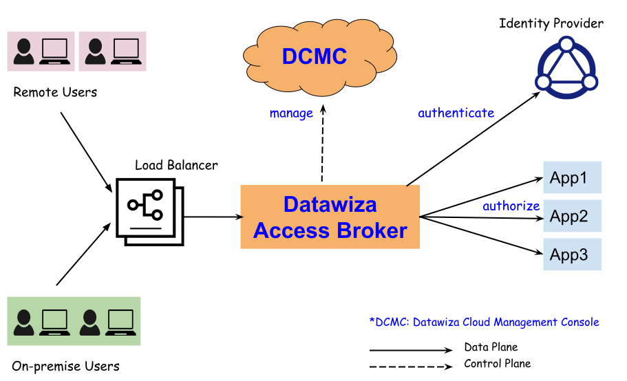

# Architecture
## System Architecture

Datawiza Access Broker (DAB) is an **identity-aware reverse proxy** sitting in front of applications.
The traffic to applications reaches DAB first, and then is proxied to applications if it's allowed by the access policies.
The following diagram illustrates a typical architecture when deploying DAB. 

DAB is managed by a centralized cloud-based management console: Datawiza Cloud Management Console (DCMC). 
DCMC provides UI and Restful APIs for administrators to manage the configurations of DAB and its access control policies. 
No matter DABs are deployed in AWS, GCP, Azure or on-premise, all of them can be managed by the single DCMC. 

## Deploy Modes
DAB can be deployed via the following two modes:
* **Sidecar mode**. DAB is deployed on the same server where the application resides. DAB proxies traffic to applications via _localhost_.   
* **Standalone mode**. DAB is deployed on a different server than where the application resides.

Under both deploy modes, **make sure your application only allows the traffic from DAB to access**. Otherwise others may circumvent DAB to access application directly.
For sidecar mode, only allow your application listening to _localhost_; for standalone mode, only allow your application accepting traffic from the IPs of DAB services.

You can deploy multiple DABs for your applications. For example, you have your application running on server 1 and server 2. 
Using the sidecar mode, you may deploy one DAB on server 1 and another DAB on server 2.  
