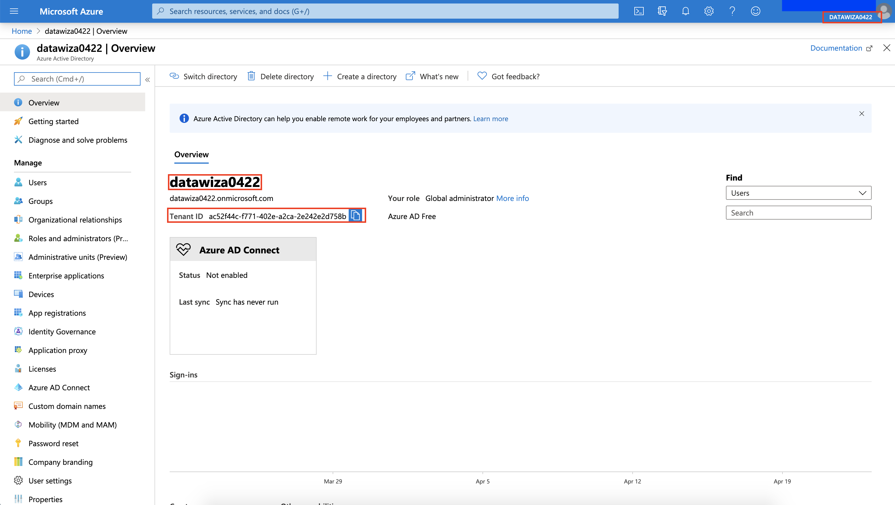
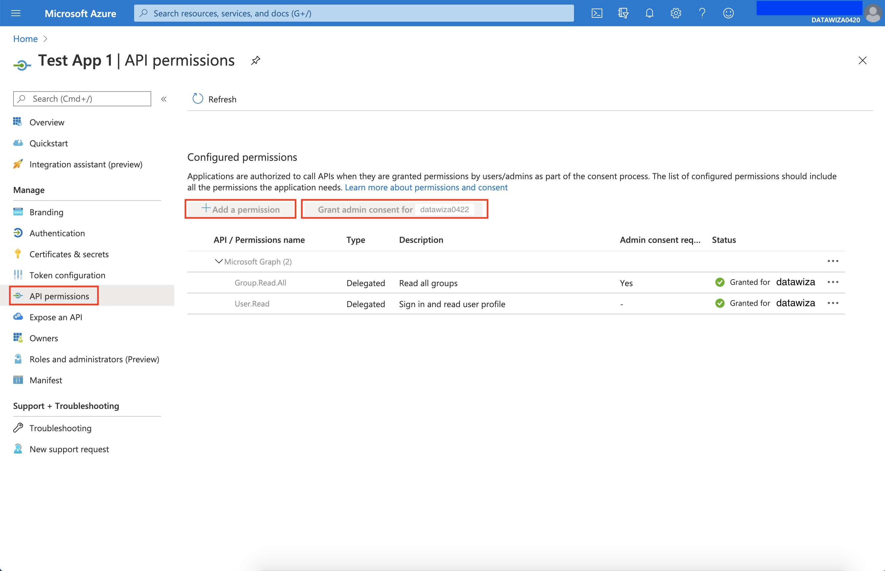
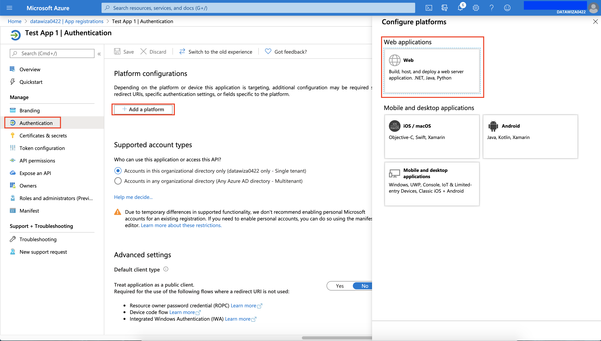
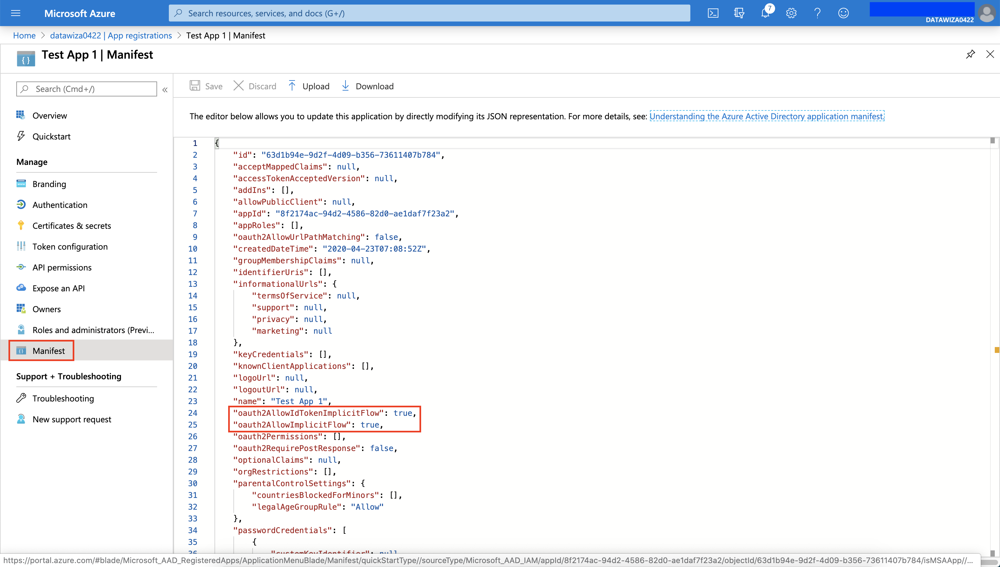

## Microsoft Azure AD Configuration

<!--

> If you are using your previous applications, please make sure your application type is Web and its grant type allowed is Authorization Code.  We will support other mode as well soon.
-->

We need to register a OIDC Web application on Microsoft Azure AD portal. After registering the application, we will have the following three values that are needed for later configuration in Datawiza Cloud Management Console (DCMC): 
* **Tenant ID**
* **Application (client) ID**
* **Client Secret**

### Create a resource in Azure
1. Log into [**Microsoft Azure**](https://azure.microsoft.com/en-us/) and Click **`+ Create a resource`** to create a new resource.

2. Choose **`Identity`** from left side bar and go forward with `Azure Active Directory`.

3. Create your directory with your desired name (e.g., your organization's name).

(Notice: "Datawiza 0422"/"datawiza0422" has been used for demo here, so "datawiza0422.onmicrosoft.com" is taken.)

### Get Tenant ID
4. Get into the directory you just created and make sure the directory (shown at the upper right corner) is the current one, which your prefer to use. (If not, you can always click on your user icon, and choose **`Switch directory`** to change it to the right one.)

### Create users and group in Azure
5. Go to **`Manage Azure Active Directory`**, choose **`Users`** from left side bar and create a new users by clicking `New user`.

6. Create an user as follow: 
    * Username: jdoe (@datawiza0422.onmicrosoft.com) 
    * Save password, e.g "Kuca8992"

7. Go to `Manage Azure Active Directory`, choose **`Group`** from left side bar and create a new group by clicking **`New group`**.

8. Create a group as follow: 
    * Group type: Security
    * Group name: HR

9. Add the user(you created earlier) to the group you just create. 
    * Add "jdoe" to "HR" group.

### App registration in Azure
10. Go to `Manage Azure Active Directory`, choose **`App Registration`** from left side bar and create a new Registration by clicking `New group`.

### Get Application ID
11. Create an Application as follow:
    * Name: Test App 1
    * Accounts in this organizational directory only (Datawiza 01 only - Single tenant)
    * Click `Register`

### Azure application configuration
### Get Client Secret
12. Get into the application you just created, choose **`Certificates & secrets`** from left side bar and create a New client secret by clicking `+ New client secret`. 
    * specify the default 1 year
    * save Client Secret e.g "2cctbjLkS_kML59xajcYT.dZIqZ-Ys_2".

13. In the application you just created, choose **`API permissions`** from left side bar and click `Grant admin consent` --> `Yes`.

14. In the application you just created, choose **`Authentication`** from left side bar and click `+ Add a platform` --> `Web`.

15. Configure `Web` as follow:

16. In the application you just created, go to `Manifest` and make sure the following settings are correct.
    * "oauth2AllowIdTokenImplicitFlow": true
    * "oauth2AllowImplicitFlow": true
    * otherwise set to true and save

### Summary
Double-check and prepare to deploy services via Datawiza Cloud Management Console. Please make sure to save following three values for later setting in Datawiza Cloud Management Console.
* **Tenant ID**
* **Application (client) ID**
* **Client Secret**
