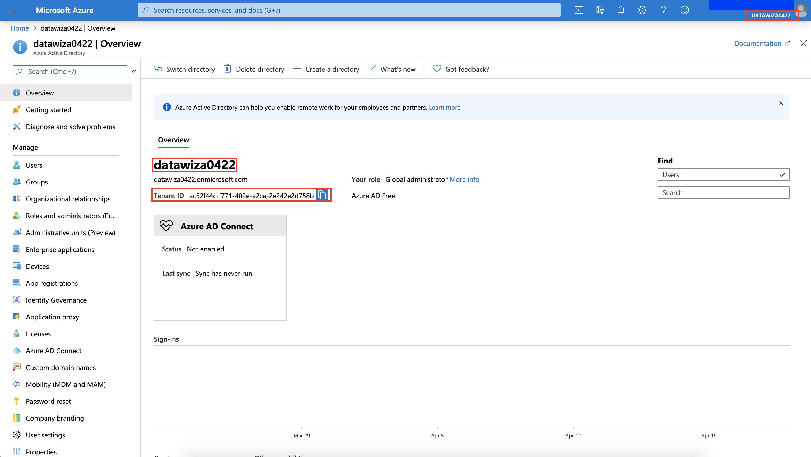
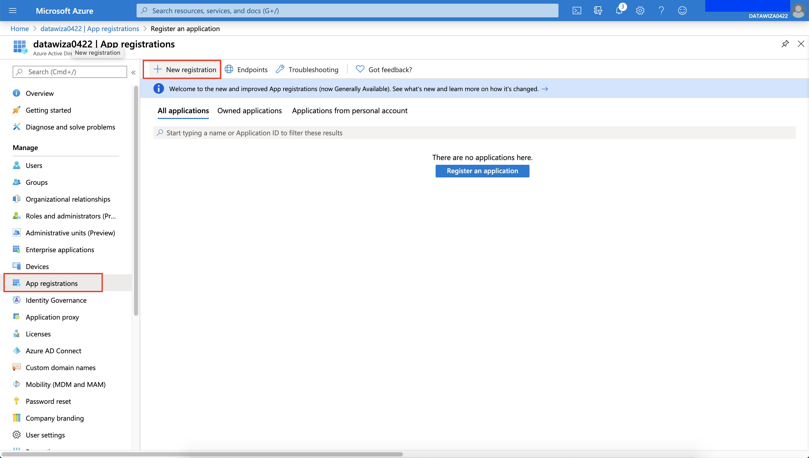
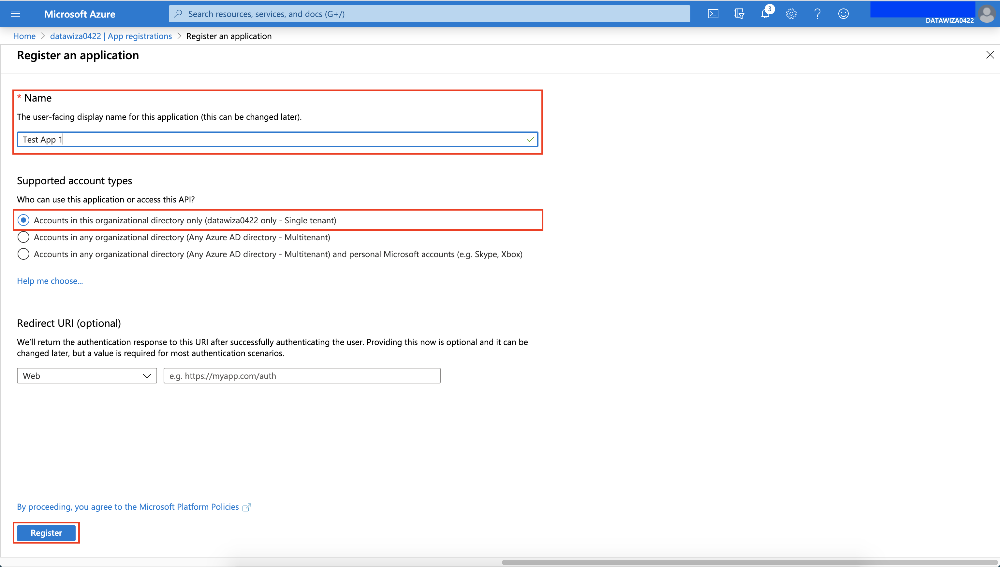
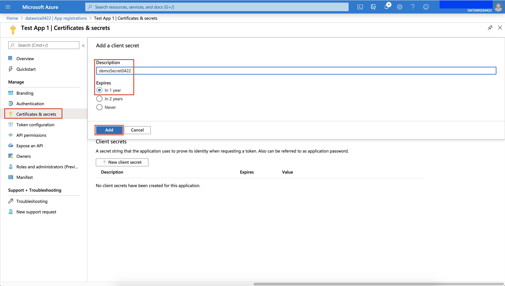
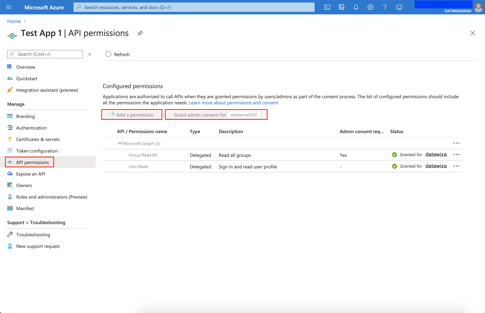
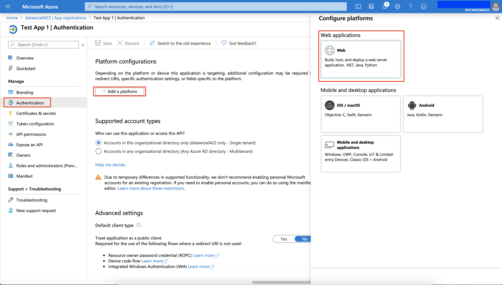
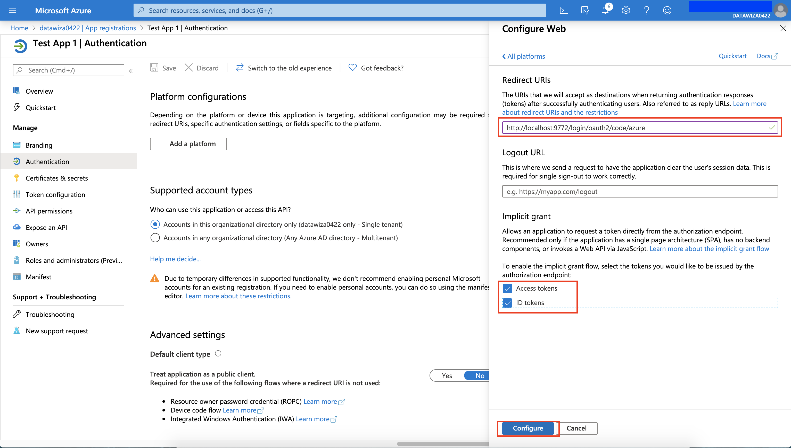
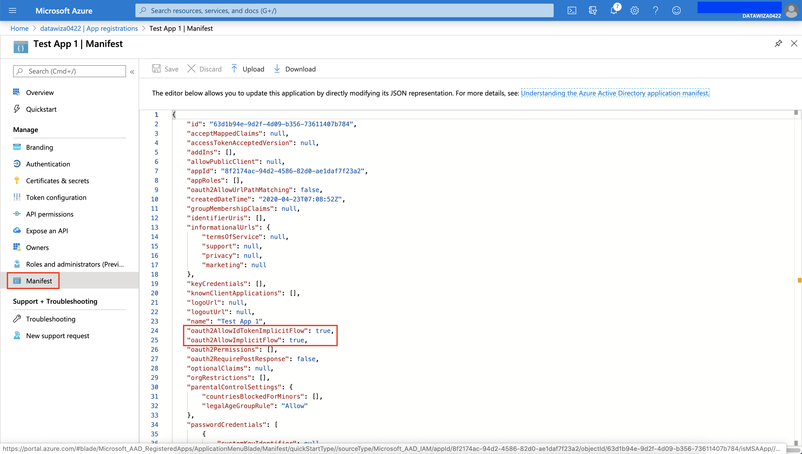

# Microsoft Azure AD Configuration
This session shows how to register an OIDC Web application on Microsoft Azure AD portal. When registering the application, we are getting the following three values that are needed for later configuration in Datawiza Cloud Management Console (DCMC):
* **Tenant ID**
* **Application (client) ID**
* **Client Secret**

## Get Tenant ID
1. Find **`Tenant ID`** on your Azure AD's overview portal.

## App registration in Azure
2. Choose **`App Registrations`** from the left side bar and create a new Registration by clicking `New registration`.

3. Create an Application as follow:
    * Name: e.g.,Test App 1
    * Accounts in this organizational directory only (Datawiza 01 only - Single tenant)
    * Click `Register`
    * Save the **"Application ID"** after you successfully registered the Application

4. In the same application you just created, choose **`Certificates & secrets`** from the left side bar and create a New client secret by clicking `+ New client secret`.
    * Specify the default 1 year
    * Save the **"Client Secret"** after you successfully created a new client secret

5. In the application you just created, choose **`API permissions`** from the left side bar. `User.Read` should already be configured by default. You can find `Group.Read.All` under: `Add a Permission` --> `Microsoft Graph` --> `Delegated Permissions` --> `Group` --> `Group.Read.All`. 

6. In the application you just created, choose **`Authentication`** from the left side bar and click `+ Add a platform` --> `Web`.

7. Configure `Web` as follows:
    * Redirect URLs: `http://localhost:9772/login/oauth2/code/azure`

8. In the application you just created, go to `Manifest` and make sure the following are  set to `true`.
    * "oauth2AllowIdTokenImplicitFlow": true
    * "oauth2AllowImplicitFlow": true

## Summary
We have shown how to register a `web` application on azure AD. Please make sure to save following three values for later setting in Datawiza Cloud Management Console.
* **Tenant ID**
* **Application (client) ID**
* **Client Secret**
