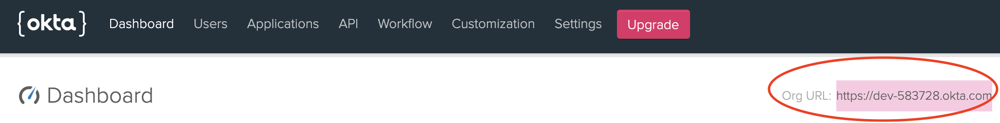

# Okta Configuration
This session shows how to register a Web application on the Okta developer console. When registering the application, we are getting the following four values that are needed for later configuration in Datawiza Cloud Management Console (DCMC): 
* **API key**
* **API Secret**
* **API token**
* **Okta Org**

## Add new application
1. Create a new application. When performing this step, make sure to login to your developer account on Okta. Visit the link [here](https://developer.okta.com/signup/) to create a developer account.

2. Choose `Web` platform, then click `next`.

## Create your Okta application
3. Fill out the form, give your application a descriptive name. e.g., Header base application demo. Follow the steps below:
* `Base URIs`: e.g., http://localhost:9772/
* `Login redirect URIs`: e.g., http://localhost:9772/authorization-code/callback
* `Logout redirect URIs`: e.g., http://localhost:9772/ab-logout-success
* Others remain default settings
* Then click `Done`

## Okta Client ID and Client Secret
4. On the general information setting page, please make a copy of **Client ID and Client secret** under the `Client Credentials` section. You will need these two codes later to build up the connection.

## Create API token in Okta
5. Choose **`API`** and then create your own token. Please be aware of the **token value**. Okta API token is used by DAB to get user information, especially for those customized user attributes.  

## Save ‘Okta Org’ URL
6. Click the "Okta" logo to return back to your Dashboard. Locate the organization URL in the upper-right corner which takes the form of `https://your_domain.okta.com`. Save this URL as `Okta Org`. 

## Assign Application in Okta
7. Double check members are linked to the right applications (if not, choose **`Assign Applications`** by clicking the green button to manually add).

## Summary
We have shown how to register a `web` application on Okta. Please make sure to save the following four values for later setting in Datawiza Cloud Management Console.
* **API key**
* **API Secret**
* **API token**
* **Okta Org**
