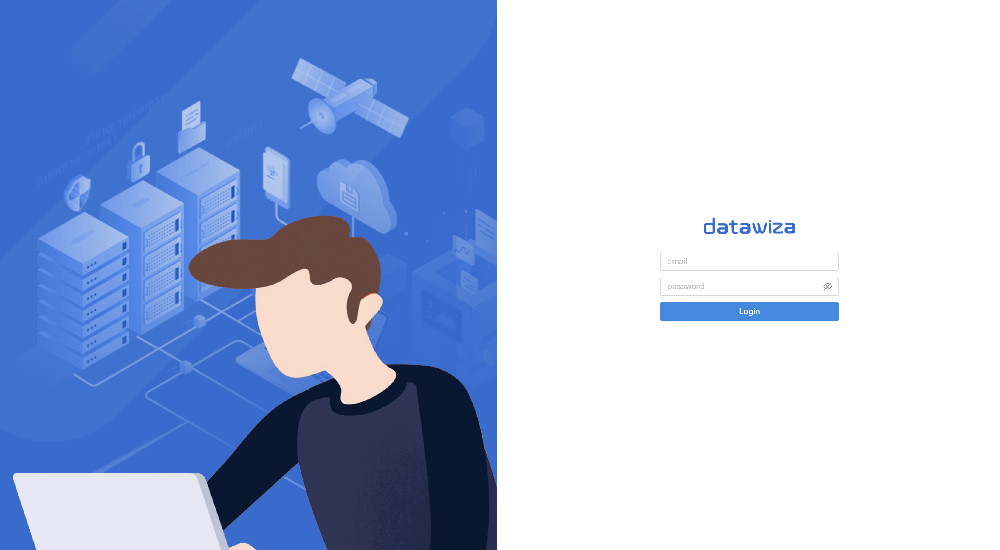

# Datawiza Cloud Management Console Configuration

## Preview
In this section, we will show you how to create an application on the Datawiza Cloud Management Console (DCMC) and generate a pair of `API key` and `API secret` for this app. This keypair is used in order for the Datawiza Access Broker to get the latest configurations and policies from the Datawiza Cloud Management Console. 

## Sign Into DCMC
1. Log into [**DCMC**](http://console.datawiza.com/home) (Need DCMC user name and password? contact us at **info@datawiza.com**).

## Create New Applications In DCMC
Welcome to the DCMC homepage. Let’s get started:
1. Click the orange button to **create a new application** integration:

2. Choose your IdP:
### **Azure**

### **Okta**

3. Keep the **web platform** option:

## Configure Application Settings in DCMC

### Azure
1. `Public Domain`: e.g., http://localhost:9772. Make sure to use `http` instead of `https`.
2. Copy and paste your previously saved **Client ID, Client Secret, and Tenant ID** from Azure
4. Set the `Upstream Server` to: e.g., http://host.docker.internal:3001
5. Then click `Create`

Note that **`upstream sever`** is the address of the application that you want to enable SSO. 
* If you use DAB sidecar mode and your application is running on `localhost:3001` on Mac and Windows, then set upstream server to `host.docker.internal:3001` (Docker 18.03+).
* If your application is running on Linux, use `ip addr show docker0` to get docker host IP (e.g., `172.17.0.1`) and then set upstream server to `172.17.0.1:3001` (see [this](https://stackoverflow.com/questions/24319662/from-inside-of-a-docker-container-how-do-i-connect-to-the-localhost-of-the-mach) for more details).

### Okta
1. `Public Domain`: e.g., http://localhost:9772
2. Copy and paste your **Okta Org URL** 
3. Copy and paste your previously saved **Client ID, Client Secret, and Okta API token** from Okta
4. Set the `Upstream Server` to: e.g., http://host.docker.internal:3001 
5. Then click `Create`

Note that **`upstream sever`** is the address of the application that you want to enable SSO. 
* If you use DAB sidecar mode and your application is running on `localhost:3001` on Mac and Windows, then set upstream server to `host.docker.internal:3001` (Docker 18.03+).
* If your application is running on Linux, use `ip addr show docker0` to get docker host IP (e.g., `172.17.0.1`) and then set upstream server to `172.17.0.1:3001` (see [this](https://stackoverflow.com/questions/24319662/from-inside-of-a-docker-container-how-do-i-connect-to-the-localhost-of-the-mach) for more details).

## Generate API Keys and Secret on DCMC
1. Go to your `Application` and select `API Keys` to generate.

2. Please make a note of your new created **API Key and API Secret**. These will be used for running DAB later:

## Summary
We have shown you how to create an application on the DCMC and generate a pair of `API key` and `API secret` for this app.
