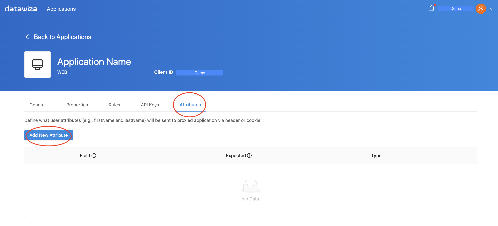
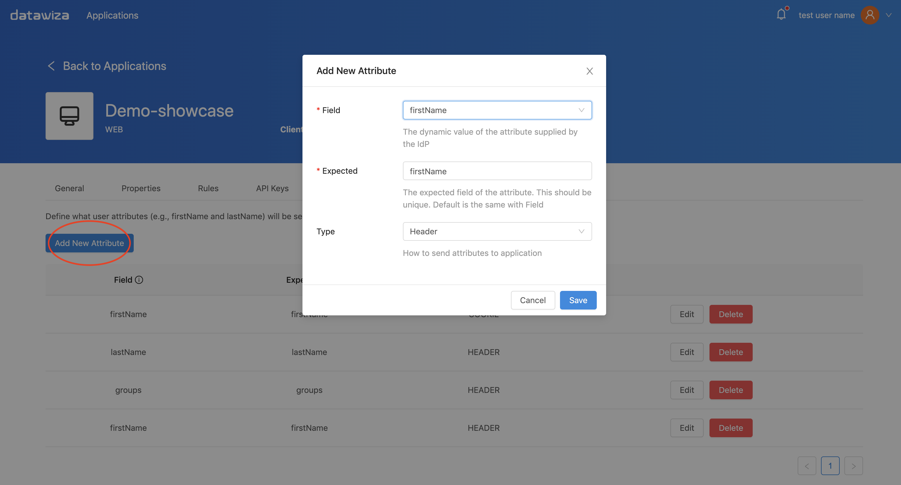

# Pass User Attributes
DAB gets user attributes from IdP and can pass the user attributes to the application via header or cookie. You can configure these attributes on Datawiza Cloud Management Console (DCMC).

On DCMC, click the name of your application, then select **`Attributes`**. 

To add attribute, you need to set
* `Field` - The original name of the user attribute from your IdP.
* `Expected` - The name of the user attribute your application is expecting.
* `Type` - It could be header or cookie. 

See the following screenshot as an example. 
