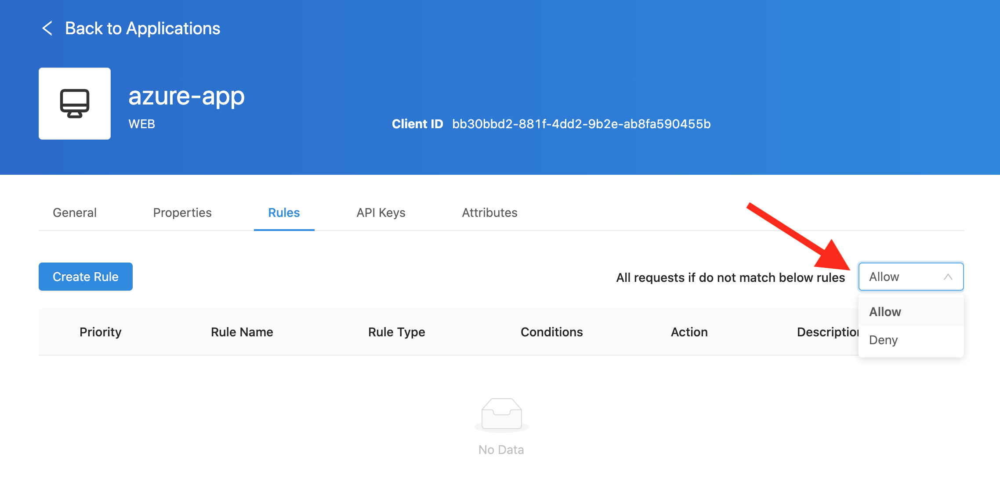
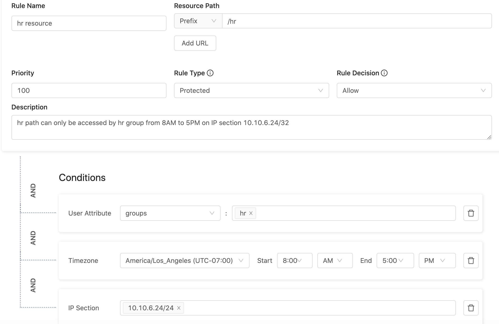

## Granular Access Control
We provide a unified management console for customers to mange their access policies for apps deployed in scattered environments. For example, some applications are deployed in AWS, Azure Cloud, and some applications are deployed on premise. All of them can be managed by our DCMC.

You can configure access control to an application based on user's attributes (e.g., groups, department) and other metadata of a request (e.g., URL, IP, http method, access time) on DCMC.

For a particular http request trying to access the app, the configured rules are executed sequentially based on the priority numbers. The rule with a smaller priority number has higher priority.

A rule includes two parts: `conditions` and `action`. If the `conditions` of a request are met, then the action of the request is decided, either `allow` or `deny`. If none of the rules' conditions are met, the default action of all requests is taken, which can be configured as shown below.

Our rule is `Resource Path` oriented. It means that you define the access rules for a `URL` of your app. For example, you may want to set your default action to `deny` for all paths. But for the `hr` resource path, you want it only be accessed by people in `hr` group `from 8AM to 5PM` on IP section `10.10.6.24/24`. Then you can configure it as follows. 

The following table summarises the fields of rules.

| Fields of Rule                   | Description  
| :------------                    | :---------- 
| `Rule Name`                      | A name for this specific rule           
| `Resource Path`                  | Choose prefix or exact URI          
| **`Priority`**                   | **Positive integer** only        
| `Rule Type`                      | Protect or Not Protect           
| `Rule Decision`                  | Allow or Deny    

Please be aware of **`Priority`** : Lower number indicates higher priority. 100 is highly recommended for your first rule configuration in order to add other rules with different priority levels.

The following table summarizes the conditions of rules. 

| Conditions                       | Description  
| :------------                    | :----------   
| `User Attribute`                 | Attributes from IdP          
| `IP Section`                     | IP address          
| `Method`                         | HTTP method           
| `Date and time`                  | Server time zone
| `Group`                          | Group name          

