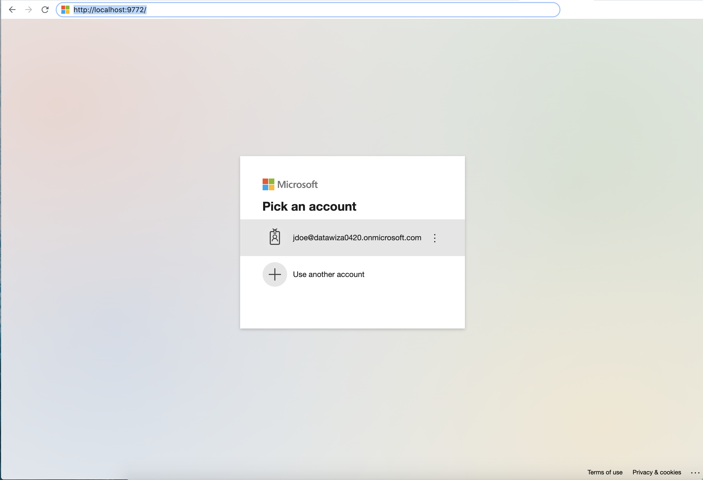
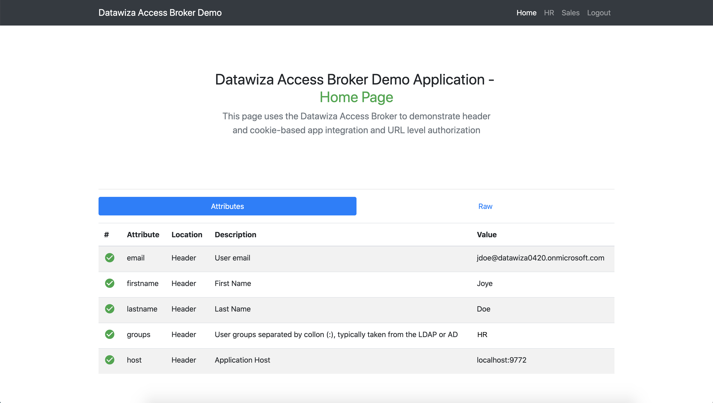
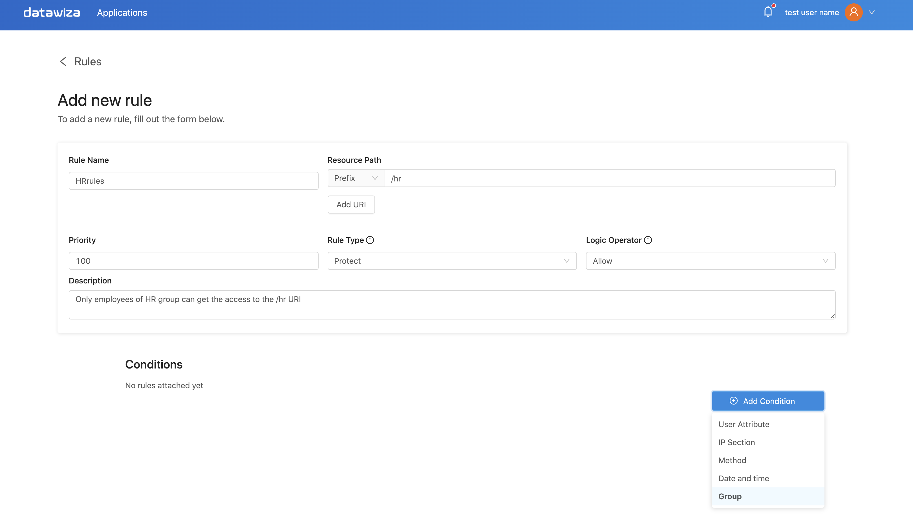
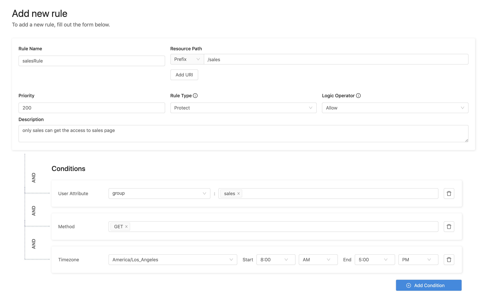
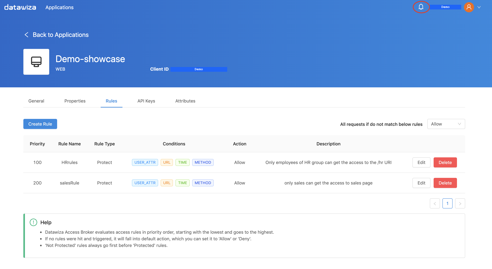
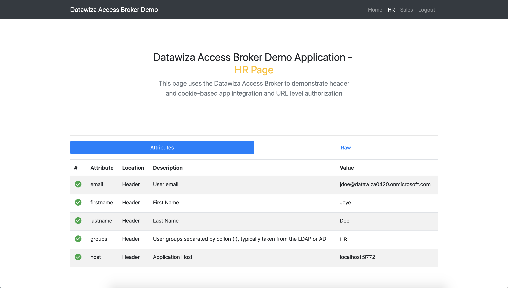

# Enable SSO and Granular Access Control For A Header-Based Web App with Microsoft Azure Active Directory (AD)


## Preview 
In this tutorial, we will use DAB to enable SSO and granular access control for a header-based web App. The IdP we will use is Azure AD. We will use DAB's side deployment mode, which means DAB and this app are running on a same server. 

* The application will run on `localhost:3000`.
* The DAB will run on `localhost:9772`, which means the traffic to app will reach DAB (running on port 9772) first and then be proxied to the application (running on port 3000).
* We will provide the docker images of the DAB and this header-based application. 


## Part I: Azure AD Configuration
You need to register an OIDC application in Azure AD management portal and get the following 3 values for this application:
* **Tenant ID**
* **Application (client) ID**
* **Client Secret**

These values will later be used to set up Datawiza Access Broker in Datawiza Cloud Management Console. Please follow [IdP Configuration Guide: Microsoft Azure AD](../idp/azure.md) instructions on how to get those keys/values.

## Part II: Create Application on Datawiza Cloud Management Console (DCMC)
You need to create a application and generate a pair of `API key` and `API secret` for this app on DCMC. 

Please follow [Step2 : Datawiza Cloud Management Console](../step-by-step/step2.md) to configure.

## Part III: Run DAB With a Header-Based Application
You may use docker or docker-compose to run DAB. The following is an example `docker-compose.yml` file. You may need to login to our container registry to download the images of DAB and the header-based app. See  [Step3 : Configure DAB and SSO Integration](../step-by-step/step3.md) for more details.

```
version: '3'

services:
    datawiza-access-broker:
	    image: registry.gitlab.com/datawiza/access-broker:1.2.6
	    container_name: datawiza-access-broker
	    restart: always
	    ports:
  	    - "9772:9772"
	    environment:
  	    MGMT_API_KEY: XXXXXXXXXXXXXXXXX
  	    MGMT_API_SECRET: XXXXXXXXXXXXXXX
  	    CONNECTOR_NAME: aad
 
    header-based-app:
	    image: registry.gitlab.com/datawiza/header-based-app
	    container_name: ab-demo-header-app
	    estart: always
	    ports:
  	    - "3001:3001"      
 ```

After executing `docker-compose -f docker-compose.yml up`,  the header-based app should have SSO enabled with Azure AD. Open a browser and type in `http://localhost:9772/`. You should see the Azure AD login page as follows. Note that if you are already logged in Azure AD in your browser, you may need to logout to see the login page.


## Part IV: Pass User Attributes to the Header-Based App
DAB gets user attributes from IdP and can pass the user attributes to the application via header or cookie.

Please follow the instructions of [Step4 : Pass User Attributes](../step-by-step/step4.md) to pass the user attributes to the header-based app, which is expecting:
* email
* firstname
* lastname
* groups

After successfully configuring the user attributes, you should see the green check sign for each of the user attributes as follows. 


## Part V: Achieve Granular Access Control

### DCMC
Click [Step5 : Achieve Granular Access Control](../step-by-step/step5.md) for detailed instructions on how to set up access rules in DCMC.

### Localhost 
After setting up your customized rules in Datawiza Cloud Management Console, please type e.g., localhost:9772 in your browser.

### Rule example
### Set up customized rules
1. If there is a URI that only can be accessed by a specific group, set the Matching Rule Regex to that group name. 
2. The following example sets the Matching Rule to URI /testgroup1 to Group: HR. URI /sales to Group: Sales.



3. You will get updated from the upper right ring bell once the rule has been created. 


### Example
1. Since Jdoe is in the HR group, he can get the access to HR page according to the rules that are just added.


2. But he is not in the Sales group, his request to Sales page has been denied based on the rule.


