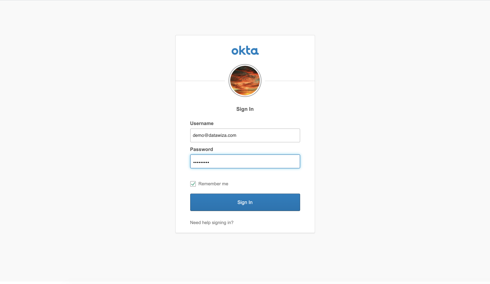
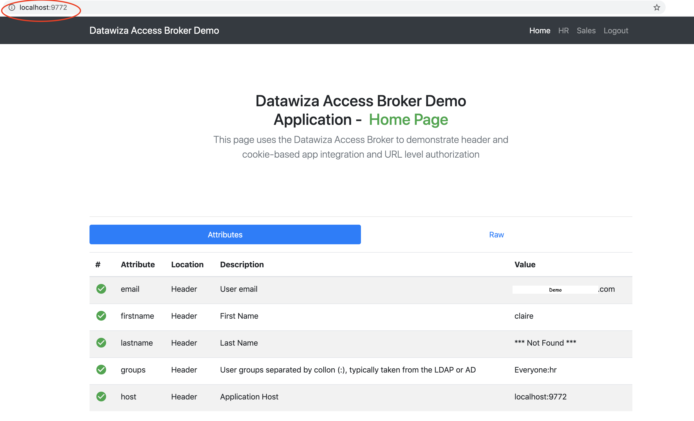
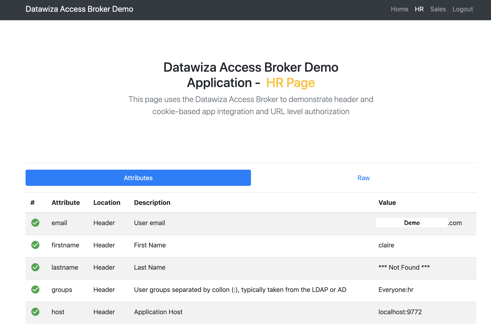
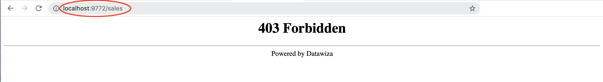

# Enable SSO and Granular Access Control For A Header-Based Web App with Okta

## Preview 
In this Okta tutorial, we will use the DAB to enable SSO and granular access control for a header-based web App. The IdP we will use is Okta. We will use DAB's side deployment mode, which means DAB and this app are running on the same server.

* The application will run on `localhost:3001`.
* The DAB will run on `localhost:9772`, which means the traffic to the app will reach DAB (running on port 9772) first and then be proxied to the application (running on port 3001).
* We will provide the docker images of the DAB and this header-based application. 

## Part I: Okta Configuration
You will need to register an application in the Okta developer console and get the following four values for this application:
* **API key**
* **API Secret**
* **API token**
* **Okta Org**

These values will later be used to set up Datawiza Access Broker in Datawiza Cloud Management Console. Please follow [IdP Configuration Guide: Okta](../idp/okta.md) instructions on how to get those keys/values.

## Part II: Create Application on Datawiza Cloud Management Console (DCMC)
You need to create an application and generate a pair of `API key` and `API secret` for this app on DCMC. 

Please follow [Step2 : Datawiza Cloud Management Console](../step-by-step/step2.md) to configure.

## Part III: Run DAB With a Header-Based Application
You may use docker or docker-compose to run DAB. The following is an example `docker-compose.yml` file. You may need to login to our container registry to download the images of DAB and the header-based app. See  [Step3 : Configure DAB and SSO Integration](../step-by-step/step3.md) for more details.

```
version: '3'

services:
  datawiza-access-broker:
    image: registry.gitlab.com/datawiza/access-broker:1.2.6
    container_name: datawiza-access-broker
    restart: always
    ports:
      - "9772:9772"
    environment:
      MGMT_API_KEY: XXXXXXXXXXXXXXXXXXXXXXXXXXXXX
      MGMT_API_SECRET: XXXXXXXXXXXXXXXXXXXXXXXXXX
      # The valid values are: {"okta.oidc", "aad"}
      CONNECTOR_NAME: okta.oidc

  header-based-app:
    image: registry.gitlab.com/datawiza/header-based-app
    container_name: ab-demo-header-app
    restart: always
    ports:
      - "3001:3001"
 ```

After executing `docker-compose -f docker-compose.yml up`,  the header-based app should have SSO enabled with Okta. Open a browser and type in `http://localhost:9772/`. You should see the Okta login page as follows. Note that if you are already logged in with Okta in your browser, you may need to logout to see the login page.



## Part IV: Pass User Attributes to the Header-Based App
DAB gets user attributes from IdP and can pass the user attributes to the application via header or cookie.

Please follow the instructions of [Step4 : Pass User Attributes](../step-by-step/step4.md) to pass the user attributes to the header-based app, which is expecting:
* email
* firstname
* lastname
* groups

After successfully configuring the user attributes, you should see the **green check** sign for each of the user attributes as follows.



## Part V: Achieve Granular Access Control
You can configure access control to an application based on user's attributes (e.g., groups, department) and other metadata of a request (e.g., URL, IP, http method, access time).

Please reference [Step5 : Achieve Granular Access Control](../step-by-step/step5.md) for detailed instructions on how to set up access rules. You can practice the rule configuration using the following example.


### A Rule Example
1. Create a user in Okta, put the user in `hr` group, and then assign this person to your application on Okta.
2. Create the following two rules:
* `hr path` can only be accessed by `hr group`.
* `sales path` can only be accessed by `sales group`.
3. Verify that the user you created can only access `hr` page in the header-based app, but cannot access `sales` page. Trying to access the header-based application on `localhost:9772` in your browser, you should get something similar to the following screenshots.



